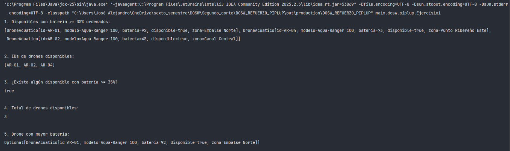

# PIPLUP FASE 01— DOSW

## Datos personales:
- Nombre y Apellido: Jose Alejandro Martinez Arias
- Código de Estudiante: 1000104385
- Curso: DOSW (Desarrollo y operaciones sofware)

---

### Ejercicio 01 — Filtrar y ordenar la flota de drones acuáticos disponibles

Se requiere gestionar la flota de drones acuáticos a través del API de Streams de Java para:
1. Filtrar los drones disponibles con batería mayor o igual al 35% y ordenarlos descendentemente según su nivel de carga.
2. Obtener una lista con únicamente los identificadores (`id`) de los drones que se encuentren disponibles.
3. Verificar si existe al menos un dron disponible con batería suficiente (>= 35%).
4. Contabilizar la cantidad total de unidades disponibles.
5. Determinar cuál es el dron con mayor porcentaje de batería en la flota.

**Código implementado:**

`DroneAcuatico.java`
```java
package main.dosw.piplup;

public record DroneAcuatico(
        String  id,
        String  modelo,
        int     bateria,       // 0-100%
        boolean disponible,
        String  zona           // "Embalse Norte", "Canal Central", etc.
) {}
```

`ConsultorFlota.java`

```Java
package main.dosw.piplup;

import java.util.Comparator;
import java.util.List;
import java.util.Optional;

public class ConsultorFlota {

    public List<DroneAcuatico> obtainDroneAvailableWithEnoughBattery(List<DroneAcuatico> drones){
        return drones.stream().filter(drone -> drone.bateria() >= 35)
                .filter(DroneAcuatico::disponible)
                .sorted(Comparator.comparing(DroneAcuatico::bateria).reversed()).toList();
    }

    public List<String> obtainIdsDronesAvailable(List<DroneAcuatico> drones){
        return drones.stream().filter(DroneAcuatico::disponible).map(DroneAcuatico::id).toList();
    }

    public boolean existsDroneAvailableWithEnoughBattery(List<DroneAcuatico> drones){
        return drones.stream().anyMatch(drone -> drone.disponible() && drone.bateria() >= 35);
    }

    public long amountDronesAvailable(List<DroneAcuatico> drones){
        return drones.stream().filter(DroneAcuatico::disponible).count();
    }

    public Optional<DroneAcuatico> obtainDroneWithLargestBattery(List<DroneAcuatico> drones){
        return drones.stream().max(Comparator.comparing(DroneAcuatico::bateria));
    }
}
```

`Ejercisio1.java`

```Java
package main.dosw.piplup;

import java.util.List;

public class Ejercisio1 {
    public static void main(String[] args){
        List<DroneAcuatico> flota = List.of(
            new DroneAcuatico("AR-01", "Aqua-Ranger 100", 92, true,  "Embalse Norte"),
            new DroneAcuatico("AR-02", "Aqua-Ranger 100", 45, true,  "Canal Central"),
            new DroneAcuatico("AR-03", "Aqua-Ranger 100", 18, false, "Laguna Sur"),
            new DroneAcuatico("AR-04", "Aqua-Ranger 100", 73, true,  "Punto Ribereño Este")
        );

        ConsultorFlota consultor = new ConsultorFlota();

        System.out.println("1. Disponibles con batería >= 35% ordenados:");
        System.out.println(consultor.obtainDroneAvailableWithEnoughBattery(flota));

        System.out.println("\n2. IDs de drones disponibles:");
        System.out.println(consultor.obtainIdsDronesAvailable(flota));

        System.out.println("\n3. ¿Existe algún disponible con batería >= 35%?");
        System.out.println(consultor.existsDroneAvailableWithEnoughBattery(flota));

        System.out.println("\n4. Total de drones disponibles:");
        System.out.println(consultor.amountDronesAvailable(flota));

        System.out.println("\n5. Drone con mayor batería:");
        System.out.println(consultor.obtainDroneWithLargestBattery(flota));
    }
}
```

**Captura de ejecución:**  


**Explicación:**  
Se modela la entidad con el record inmutable `DroneAcuatico` y se resuelven las consultas mediante la API de Streams:
- `filter()` para validar la disponibilidad y el umbral de carga.
- `sorted()` junto con `Comparator.comparing().reversed()` para ordenar de mayor a menor batería.
- `map()` con referencia a método (`DroneAcuatico::id`) para proyectar la lista de identificadores.
- `anyMatch()` para comprobar de forma eficiente si hay al menos una coincidencia.
- `count()` para el total de drones activos y `max()` para obtener el dron con mayor batería envuelto de forma segura en un `Optional`.