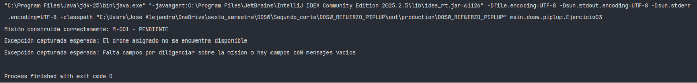

# PIPLUP FASE 01— DOSW

## Datos personales:
- Nombre y Apellido: Jose Alejandro Martinez Arias
- Código de Estudiante: 1000104385
- Curso: DOSW (Desarrollo y operaciones sofware)

---

### Ejercicio 01 — Filtrar y ordenar la flota de drones acuáticos disponibles

Se requiere gestionar la flota de drones acuáticos a través del API de Streams de Java para:
1. Filtrar los drones disponibles con batería mayor o igual al 35% y ordenarlos descendentemente según su nivel de carga.
2. Obtener una lista con únicamente los identificadores (`id`) de los drones que se encuentren disponibles.
3. Verificar si existe al menos un dron disponible con batería suficiente (>= 35%).
4. Contabilizar la cantidad total de unidades disponibles.
5. Determinar cuál es el dron con mayor porcentaje de batería en la flota.

**Código implementado:**

`DroneAcuatico.java`
```java
package main.dosw.piplup;

public record DroneAcuatico(
        String  id,
        String  modelo,
        int     bateria,       // 0-100%
        boolean disponible,
        String  zona           // "Embalse Norte", "Canal Central", etc.
) {}
```

`ConsultorFlota.java`

```Java
package main.dosw.piplup;

import java.util.Comparator;
import java.util.List;
import java.util.Optional;

public class ConsultorFlota {

    public List<DroneAcuatico> obtainDroneAvailableWithEnoughBattery(List<DroneAcuatico> drones){
        return drones.stream().filter(drone -> drone.bateria() >= 35)
                .filter(DroneAcuatico::disponible)
                .sorted(Comparator.comparing(DroneAcuatico::bateria).reversed()).toList();
    }

    public List<String> obtainIdsDronesAvailable(List<DroneAcuatico> drones){
        return drones.stream().filter(DroneAcuatico::disponible).map(DroneAcuatico::id).toList();
    }

    public boolean existsDroneAvailableWithEnoughBattery(List<DroneAcuatico> drones){
        return drones.stream().anyMatch(drone -> drone.disponible() && drone.bateria() >= 35);
    }

    public long amountDronesAvailable(List<DroneAcuatico> drones){
        return drones.stream().filter(DroneAcuatico::disponible).count();
    }

    public Optional<DroneAcuatico> obtainDroneWithLargestBattery(List<DroneAcuatico> drones){
        return drones.stream().max(Comparator.comparing(DroneAcuatico::bateria));
    }
}
```

`Ejercisio1.java`

```Java
package main.dosw.piplup;

import java.util.List;

public class Ejercisio1 {
    public static void main(String[] args){
        List<DroneAcuatico> flota = List.of(
            new DroneAcuatico("AR-01", "Aqua-Ranger 100", 92, true,  "Embalse Norte"),
            new DroneAcuatico("AR-02", "Aqua-Ranger 100", 45, true,  "Canal Central"),
            new DroneAcuatico("AR-03", "Aqua-Ranger 100", 18, false, "Laguna Sur"),
            new DroneAcuatico("AR-04", "Aqua-Ranger 100", 73, true,  "Punto Ribereño Este")
        );

        ConsultorFlota consultor = new ConsultorFlota();

        System.out.println("1. Disponibles con batería >= 35% ordenados:");
        System.out.println(consultor.obtainDroneAvailableWithEnoughBattery(flota));

        System.out.println("\n2. IDs de drones disponibles:");
        System.out.println(consultor.obtainIdsDronesAvailable(flota));

        System.out.println("\n3. ¿Existe algún disponible con batería >= 35%?");
        System.out.println(consultor.existsDroneAvailableWithEnoughBattery(flota));

        System.out.println("\n4. Total de drones disponibles:");
        System.out.println(consultor.amountDronesAvailable(flota));

        System.out.println("\n5. Drone con mayor batería:");
        System.out.println(consultor.obtainDroneWithLargestBattery(flota));
    }
}
```

**Captura de ejecución:**  


**Explicación:**  
Se modela la entidad con el record inmutable `DroneAcuatico` y se resuelven las consultas mediante la API de Streams:
- `filter()` para validar la disponibilidad y el umbral de carga.
- `sorted()` junto con `Comparator.comparing().reversed()` para ordenar de mayor a menor batería.
- `map()` con referencia a método (`DroneAcuatico::id`) para proyectar la lista de identificadores.
- `anyMatch()` para comprobar de forma eficiente si hay al menos una coincidencia.
- `count()` para el total de drones activos y `max()` para obtener el dron con mayor batería envuelto de forma segura en un `Optional`.

---

### Ejercicio 03 — Builder para construir misiones válidas en AquaPort

Implementar el patrón de diseño creacional Builder para la instanciación de objetos de tipo `Mision` en el sistema AquaPort. El patrón garantiza la inmutabilidad de la entidad y previene la creación de instancias con parámetros inconsistentes o nulos mediante encadenamiento de métodos y validaciones integradas en la operación terminal `build()`.

**Código implementado:**

`TipoCarga.java`
```java
package main.dosw.piplup;

public enum TipoCarga {
    MUESTRA_AGUA
}
```

`EstadoMision.java`
```java
package main.dosw.piplup;

public enum EstadoMision {
    PENDIENTE,PROCESO,FINALIZADA
}
```

`Mision.java`
```java
package main.dosw.piplup;

public class Mision {

    private final String id;
    private final DroneAcuatico drone;
    private final String puntoLlegada;
    private final String puntoPartida;
    private final TipoCarga tipoCarga;
    private final EstadoMision estadoMision;

    private Mision(String id, DroneAcuatico drone, String puntoLlegada, String puntoPartida, TipoCarga tipoCarga, EstadoMision estadoMision) {
        this.id = id;
        this.drone = drone;
        this.puntoLlegada = puntoLlegada;
        this.puntoPartida = puntoPartida;
        this.tipoCarga = tipoCarga;
        this.estadoMision = estadoMision;
    }

    public String getId() {
        return id;
    }

    public DroneAcuatico getDrone() {
        return drone;
    }

    public String getPuntoLlegada() {
        return puntoLlegada;
    }

    public String getPuntoPartida() {
        return puntoPartida;
    }

    public TipoCarga getTipoCarga() {
        return tipoCarga;
    }

    public EstadoMision getEstadoMision() {
        return estadoMision;
    }

    public static class Builder {
        private String id;
        private DroneAcuatico drone;
        private String puntoLlegada;
        private TipoCarga tipoCarga;
        private EstadoMision estadoMision = EstadoMision.PENDIENTE;
        private String puntoPartida;

        public Builder id(String id) {
            this.id = id;
            return this;
        }

        public Builder drone(DroneAcuatico drone) {
            this.drone = drone;
            return this;
        }

        public Builder puntoLlegada(String puntoLlegada) {
            this.puntoLlegada = puntoLlegada;
            return this;
        }

        public Builder tipoCarga(TipoCarga tipoCarga) {
            this.tipoCarga = tipoCarga;
            return this;
        }

        public Builder puntoPartida(String puntoPartida) {
            this.puntoPartida = puntoPartida;
            return this;
        }

        public Mision build() {
            if (id == null || drone == null || puntoLlegada == null || tipoCarga == null
                    || puntoPartida == null || id.isBlank() || puntoLlegada.isBlank() || puntoPartida.isBlank()) {
                throw new IllegalStateException("Falta campos por diligenciar sobre la mision o hay campos coN mensajes vacios");
            } else if (!drone.disponible()){
                throw new IllegalStateException("El drone asignado no se encuentra disponible");
            }

            return new Mision(id, drone, puntoLlegada, puntoPartida, tipoCarga, EstadoMision.PENDIENTE);
        }
    }
}
```

`Ejercicio03.java`
```java
package main.dosw.piplup;

public class Ejercicio03 {
    public static void main(String[] args) {
        DroneAcuatico droneValido = new DroneAcuatico("AR-01", "Aqua-Ranger 100", 85, true, "Embalse Norte");
        DroneAcuatico droneNoDisponible = new DroneAcuatico("AR-03", "Aqua-Ranger 100", 18, false, "Laguna Sur");

        // 1. Caso exitoso
        Mision misionValida = new Mision.Builder()
                .id("M-001")
                .drone(droneValido)
                .puntoPartida("Embalse Norte")
                .puntoLlegada("Laboratorio Hídrico")
                .tipoCarga(TipoCarga.MUESTRA_AGUA)
                .build();

        System.out.println("Misión construida correctamente: " + misionValida.getId() + " - " + misionValida.getEstadoMision());

        // 2. Validación de disponibilidad del drone
        try {
            new Mision.Builder()
                    .id("M-002")
                    .drone(droneNoDisponible)
                    .puntoPartida("Laguna Sur")
                    .puntoLlegada("Laboratorio Hídrico")
                    .tipoCarga(TipoCarga.MUESTRA_AGUA)
                    .build();
        } catch (IllegalStateException e) {
            System.out.println("Excepción capturada esperada: " + e.getMessage());
        }

        // 3. Validación de campos obligatorios o vacíos
        try {
            new Mision.Builder()
                    .id("")
                    .drone(droneValido)
                    .puntoPartida("Embalse Norte")
                    .puntoLlegada("   ")
                    .build();
        } catch (IllegalStateException e) {
            System.out.println("Excepción capturada esperada: " + e.getMessage());
        }
    }
}
```

**Captura de ejecución:**  


**Explicación:**  
Se encapsuló la construcción de la clase inmutable `Mision` mediante su clase anidada estática `Builder`. A través de una interfaz fluida se asignan los atributos requeridos, delegando al método `build()` la comprobación estricta de precondiciones: verifica que las cadenas no sean nulas ni estén compuestas únicamente por espacios en blanco (`isBlank()`), que las referencias a objetos/enums no sean nulas y que el `DroneAcuatico` asignado cumpla la regla de negocio de encontrarse en estado disponible. De no cumplirse alguna regla, interrumpe el flujo levantando una `IllegalStateException` descriptiva.