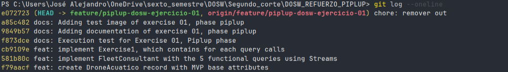

---

### Ejercicio 02 — Repositorio de AquaPort con estructura GitFlow básica

Configurar el repositorio base para AquaPort aplicando la metodología GitFlow. Se define un archivo `.gitignore` robusto para entornos Java/Maven e IDEs, asegurando que binarios y configuraciones locales no se versionen. Se implementa el flujo de trabajo creando la rama de integración `develop` y la rama de trabajo `feature/streams-consultor-flota`, gestionando la inclusión de cambios mediante commits atómicos y consolidando el trabajo en `develop` mediante un Pull Request.

**Código implementado:**

`.gitignore`
```gitignore
# Compiled class file
*.class

# Log file
*.log

# BlueJ files
*.ctxt

# Mobile Tools for Java (J2ME)
.mtj.tmp/

# Package Files #
*.jar
*.war
*.nar
*.ear
*.zip
*.tar.gz
*.rar

# virtual machine crash logs, see [http://www.java.com/en/download/help/error_hotspot.xml](http://www.java.com/en/download/help/error_hotspot.xml)
hs_err_pid*
replay_pid*

# Maven target directory
target/

# IntelliJ IDEA
.idea/
*.iml

# Eclipse
.project
.classpath
.settings/

# Visual Studio Code
.vscode/
```

`Flujo de comandos Git ejecutados:`
```bash
# Inicialización y configuración de ramas base
git init
git add .gitignore
git commit -m "chore: configurar .gitignore para Java y herramientas de desarrollo"
git branch -M main

# Creación de rama de integración develop
git checkout -b develop

# Creación de rama de característica para el reto 01
git checkout -b feature/streams-consultor-flota

# Commits atómicos de la funcionalidad
git add src/main/java/main/dosw/piplup/DroneAcuatico.java
git commit -m "feat: definir record DroneAcuatico para el modelo MVP"

git add src/main/java/main/dosw/piplup/ConsultorFlota.java
git commit -m "feat: implementar ConsultorFlota con 5 consultas Stream"

git add src/main/java/main/dosw/piplup/Ejercisio1.java
git commit -m "test: agregar clase principal para verificar consultas de flota"

# Publicación de la rama hacia el repositorio remoto
git push -u origin feature/streams-consultor-flota
```

**Pull Request:**
- **Enlace:** [Feature/piplup dosw ejercicio 01 by JoseMartinez883 · Pull Request #1 · JoseMartinez883/DOSW_REFUERZO_PIPLUP](https://github.com/JoseMartinez883/DOSW_REFUERZO_PIPLUP/pull/1)

**Captura de ejecución:**


**Explicación:**
Se estableció la estrategia de ramas con GitFlow aislando el desarrollo de la funcionalidad en la rama `feature/streams-consultor-flota` a partir de `develop`. Se redactaron commits atómicos siguiendo el estándar semántico (especificando prefijos como `feat` y `chore`), evitando mezclar cambios de configuración con lógica de negocio. Asimismo, el `.gitignore` previene la contaminación del repositorio al ignorar artefactos de compilación (`target/`, `*.class`) y metadatos de entornos de desarrollo (`.idea/`, `.vscode/`). Finalmente, la integración hacia `develop` se gestionó formalmente a través del Pull Request #1.